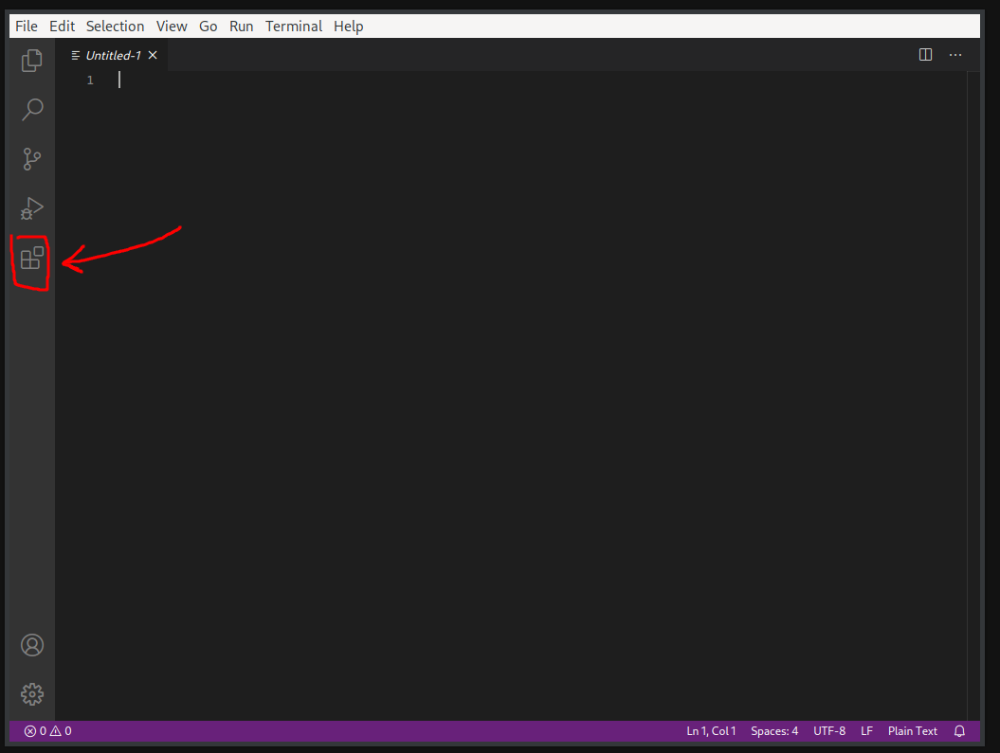
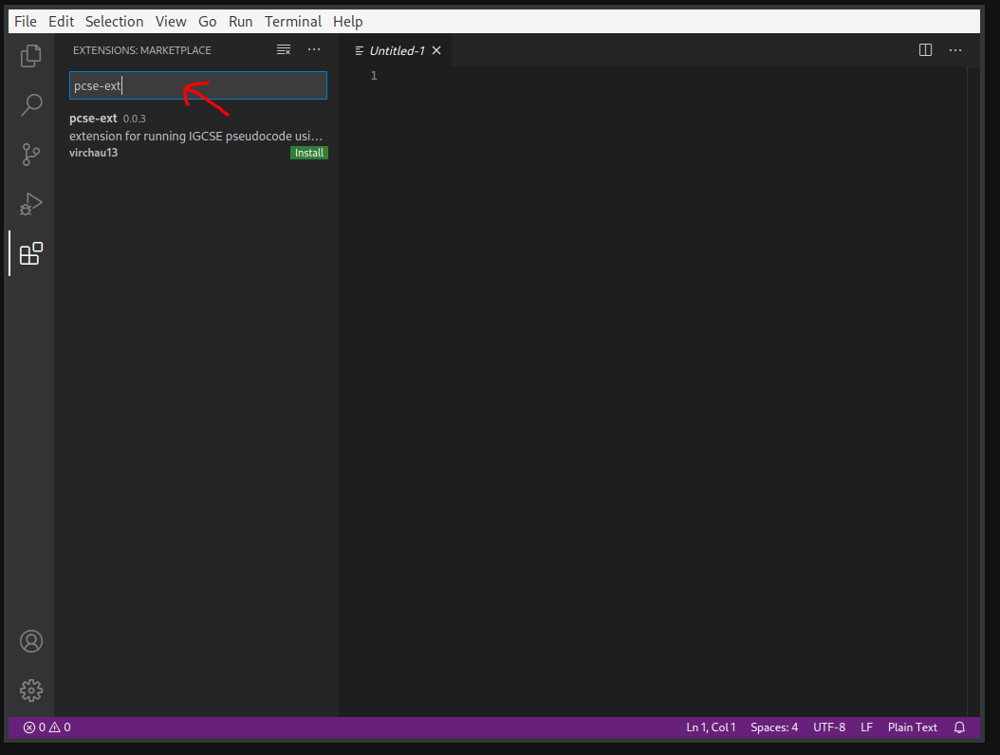
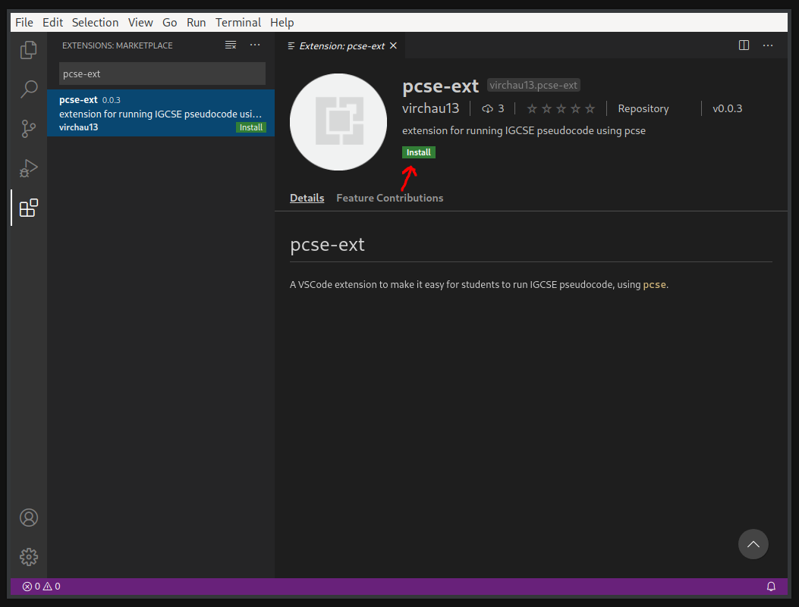
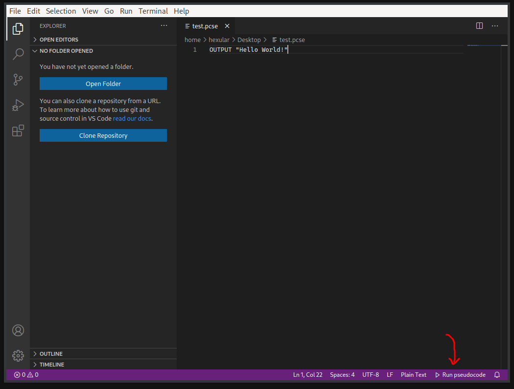
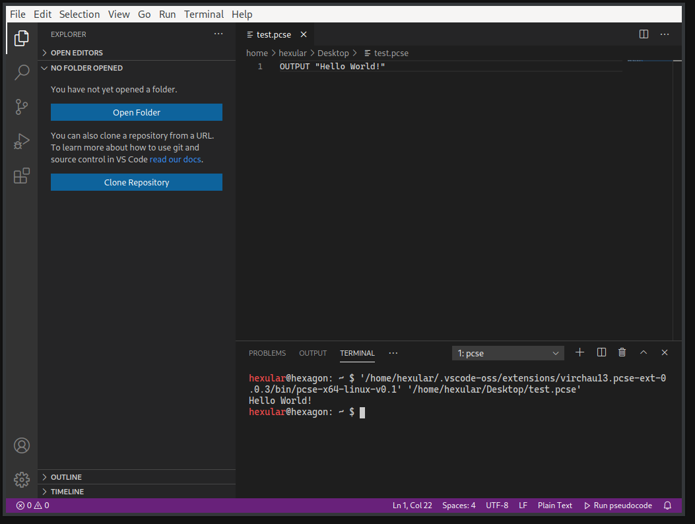

# Guide to install a pcse enviroment easily

(Note that this guide will only work on MacOS, Linux, or Windows. If you are using a different OS, file an issue! I'll get around to making a build for it.)

First, install [Visual Studio Code](https://code.visualstudio.com/).  

Open up Visual Studio Code and click the "extensions" icon.

Then, search for "pcse-ext" in the search box.

Click on the entry named "pcse-ext".

Click on the "Install" button.

The pcse environment should be set up to work now.  
You can use it by editing a file that ends in ".pcse". When you edit a file in this way, a Run button should show up on the bottom right of the screen.

When you click the button, it will run your program, and you can see output and insert any input.

